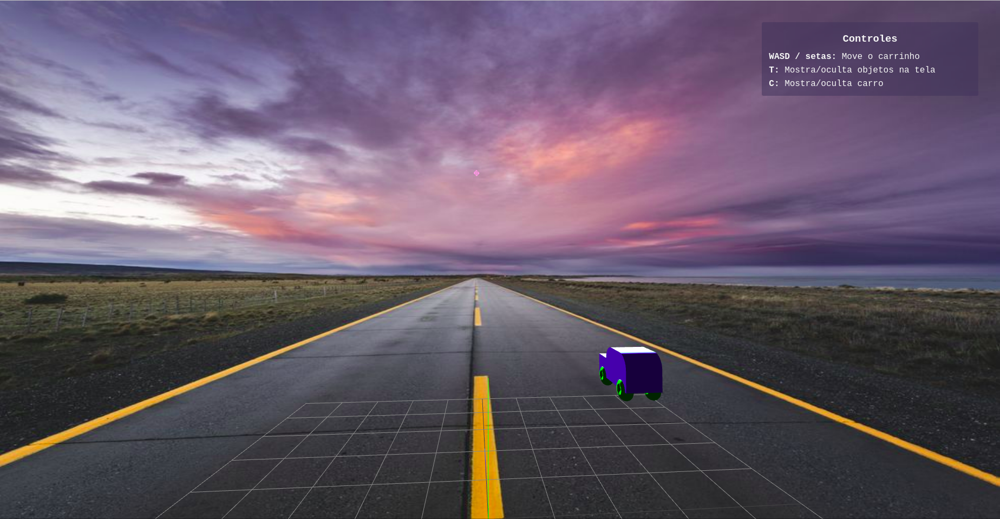

# Sunset Driving

Projeto de realidade aumentada introdutório ao Three.js para a matéria de CCI-36 do ITA

Grupo:

-   Ana Paula Schuch

-   Diego Fidalgo

-   Pedro Freitas

Link: http://sunset-driving.vercel.app

O projeto consiste em um carrinho que pode ser movido com as setas do teclado.



O carro foi construído com as primitivas `TorusGeometry`, `BoxGeometry` e `CylinderGeometry`.

A tecla `c` pode ser utilizada para mostrar/ocultar o carro, enquanto a tecla `t` para mostrar/ocultar os eixos, grid, instruções e posicionamento da lâmpada.

## Rodar Localmente

Faça o clone do repositório e instale as dependências necessárias com o comando:

```bash
$ npm install
```

Por fim, o comando abaixo roda a aplicação:

```bash
$ npm run dev
```
